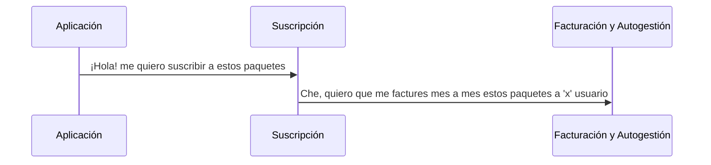
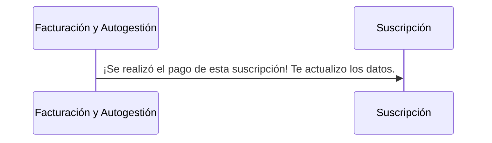
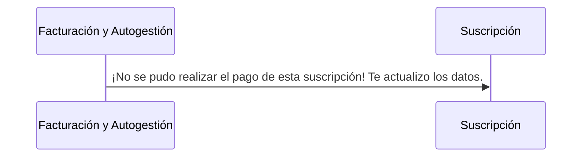
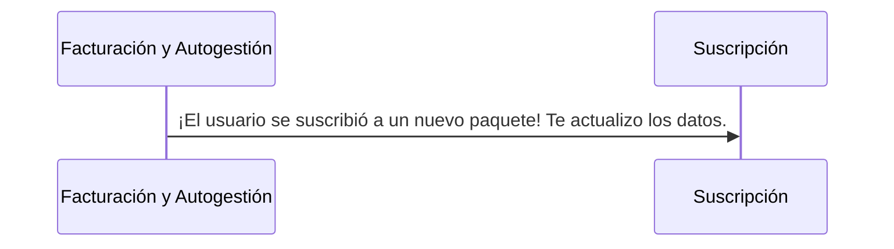
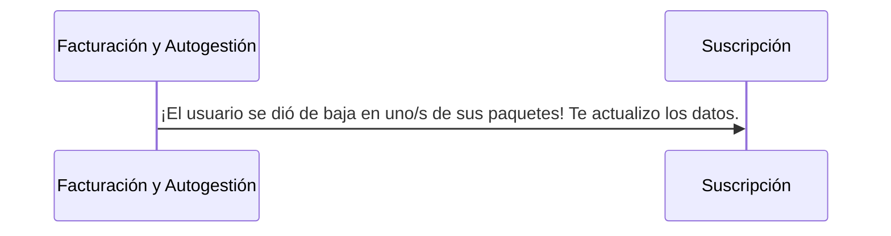
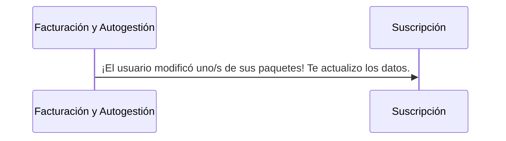

# Facturación y Autogestión

**Facturación y Autogestión** entra en acción una vez que un usuario decide suscribirse a uno o varios paquetes. 

A continuación se deja un diagrama de secuencia para entender el proceso de generación de futuras facturaciones.

Una vez generada la carga de facturación mensual (registro del usuario en nuestro sistema), nuestro módulo permitirá:

- **Realizar pagos mensuales.**
!!!success Pago aceptado

!!!

!!!danger Pago rechazado 

!!!

- **Suscribirse a nuevos paquetes.**
!!!light Nueva suscripción

!!!

- **Darse de baja de paquetes.**
!!!light Baja

!!!

- **Modificar una suscripción.**
!!!light Modificación

!!!