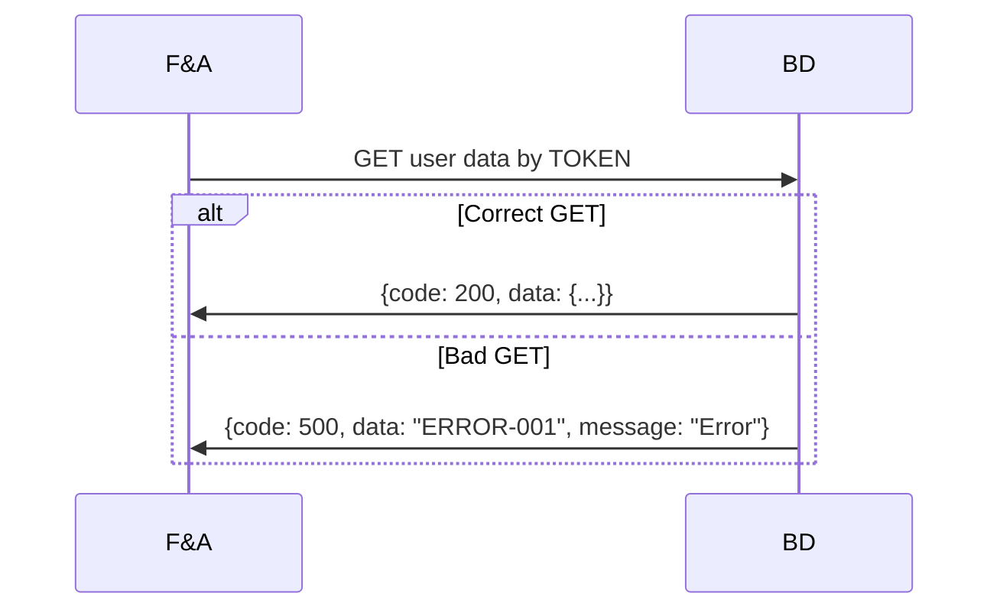
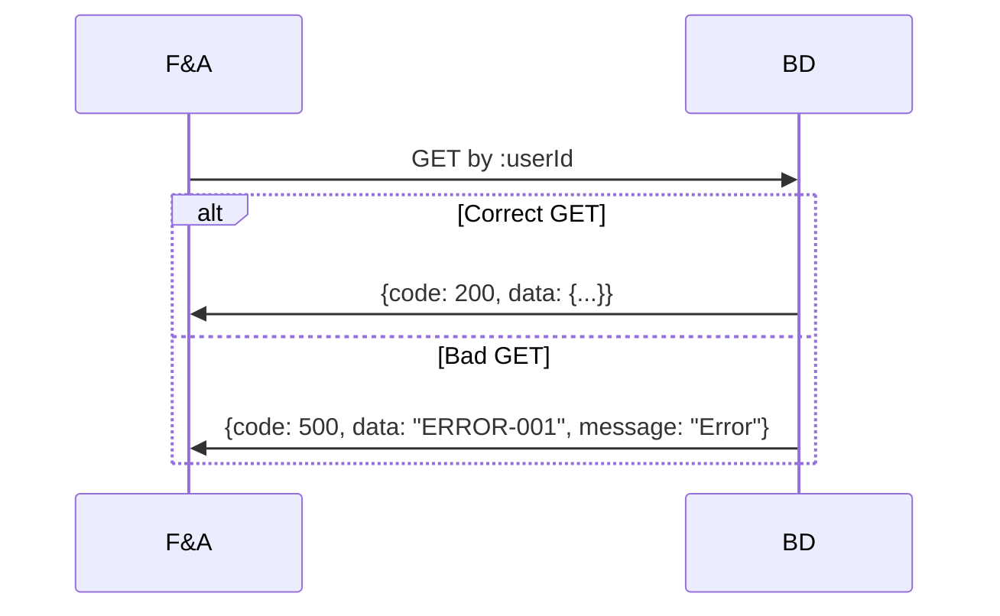
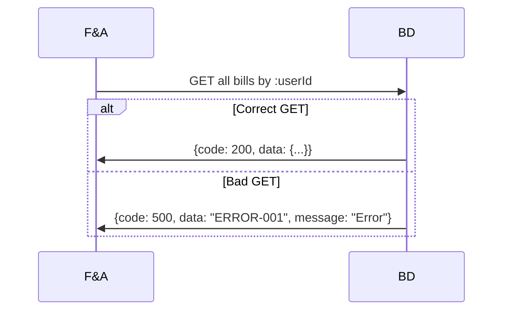
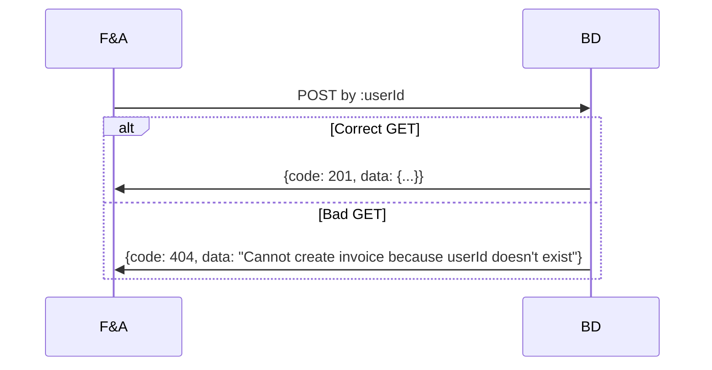
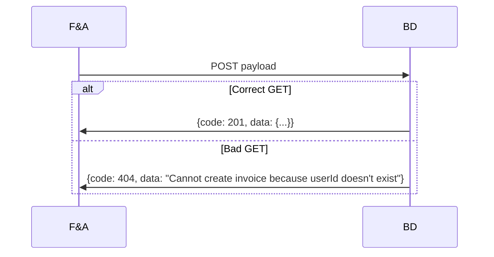

### Endpoints usuario

==- [!badge size="xl" variant="primary " text="GET"]  Obtener información de un usuario a partir de token

||| Módulo implicado
Facturación y Autogestión (F&A)
||| Descripción
Se busca la información básica de un usuario a partir del **token** suministrado por app **web/mobile**.
Esto nos permitirá poder "pintar" la aplicación frontend.
**:from** puede tomar el valor de `web` o `mobile` y **:token** el token de la app cliente.
|||

[!badge size="xl" variant="primary " text="GET"] [!badge corners="pill" size="l" variant="info" text="https://notflix-fya-backend.herokuapp.com/api/users/:from/:token"]

===

==- [!badge size="xl" variant="primary " text="GET"]  Obtener información de un usuario

||| Módulo implicado
Facturación y Autogestión (F&A)
||| Descripción
Se busca la información básica de un usuario a partir del **:userId**.
|||

[!badge size="xl" variant="primary " text="GET"] [!badge corners="pill" size="l" variant="info" text="https://notflix-fya-backend.herokuapp.com/api/users/:userId"]

===
### Endpoints suscripciones

==- [!badge size="xl" variant="primary " text="GET"]  Obtener suscripciones de un usuario

||| Módulo implicado
Facturación y Autogestión (F&A)
||| Descripción
Se buscan todas las suscripciones pertenecientes a un usuario a partir de su **:userId**.
|||

[!badge size="xl" variant="primary " text="GET"] [!badge corners="pill" size="l" variant="info" text="https://notflix-fya-backend.herokuapp.com/api/subscriptions/:userId"]

===

==- [!badge size="xl" variant="success" text="POST"]  Registrar nueva suscripción

||| Módulo implicado
Facturación y Autogestión (F&A)
||| Descripción
Se realiza el registro a un nuevo paquete.
|||

[!badge size="xl" variant="success " text="POST"] [!badge corners="pill" size="l" variant="info" text="https://notflix-fya-backend.herokuapp.com/api/subscriptions/internal"]

:::code source="../static/internalSubscriptionData.js" :::

===

### Endpoints facturas

==- [!badge size="xl" variant="primary " text="GET"]  Obtener facturas de un usuario

||| Módulo implicado
Facturación y Autogestión (F&A)
||| Descripción
Se buscan todas las facturas pertenecientes a un usuario a partir de su **:userId**.
|||

[!badge size="xl" variant="primary " text="GET"] [!badge corners="pill" size="l" variant="info" text="https://notflix-fya-backend.herokuapp.com/api/invoices/:userId"]

===

==- [!badge size="xl" variant="primary " text="GET"]  Obtener factura por id de factura

||| Módulo implicado
Facturación y Autogestión (F&A)
||| Descripción
Se obtiene factura pertenecientes a un usuario a partir de su **:billId**
|||

[!badge size="xl" variant="primary " text="GET"] [!badge corners="pill" size="l" variant="info" text="https://notflix-fya-backend.herokuapp.com/api/invoices/:userId/:billId"]

===

==- [!badge size="xl" variant="success" text="POST"]  Generar un nuevo pago

||| Módulo implicado
Facturación y Autogestión (F&A)
||| Descripción
Se realiza la facturación de todas las suscripciones del mes (30 dias) a partir de un **:userId**
|||

[!badge size="xl" variant="success " text="POST"] [!badge corners="pill" size="l" variant="info" text="https://notflix-fya-backend.herokuapp.com/api/invoices/:userId/new-paid"]

===

==- [!badge size="xl" variant="success" text="POST"]  Generar un nuevo pago con estado NO_PAGADO

||| Módulo implicado
Facturación y Autogestión (F&A)
||| Descripción
Se simula el NO pago de una suscripción a partir de un **:userId** y **:subscriptionId**
|||

[!badge size="xl" variant="success " text="POST"] [!badge corners="pill" size="l" variant="info" text="https://notflix-fya-backend.herokuapp.com/api/invoices/:userId/:subscriptionId/non-paid"]

===