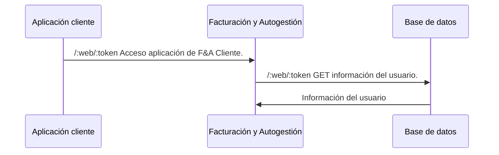

***Resumen de acciones:***



### Funcionalidad

Cuando el cliente quiera ingresar al módulo de **Facturación y Autogestión** deberá proveer en la url de redirección 2(dos) parámetros opcionales: plataforma de origen (**web** o **mobile**) y el **token**


[!badge corners="pill" size="xl" variant="info" text="https://facturacion-front.vercel.app/?from=**from**&token=**token**"]

En donde **from** puede ser `web` o `mobile` y **token** el token del cliente.

**Es importante pasar en el token el objectId del cliente**


```js Ejemplo de la información que debe estar incluido en el token
    //Este objectId es el que va a guardarse en nuestra base de datos. 
    //Es el que nos permite obtener la información del usuario
    
    objectId = "tuObjectId"; 
```

Si se manda el token de forma correcta deberá poder ver la siguiente pantalla:


Si se manda el token de forma incorrecta deberá poder ver la siguiente pantalla:

