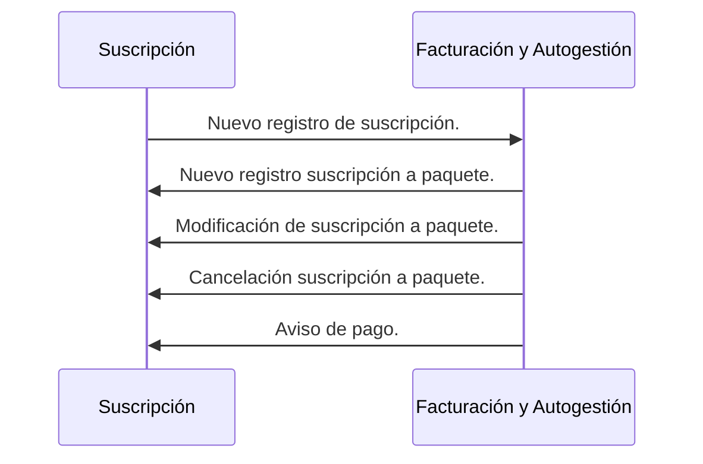
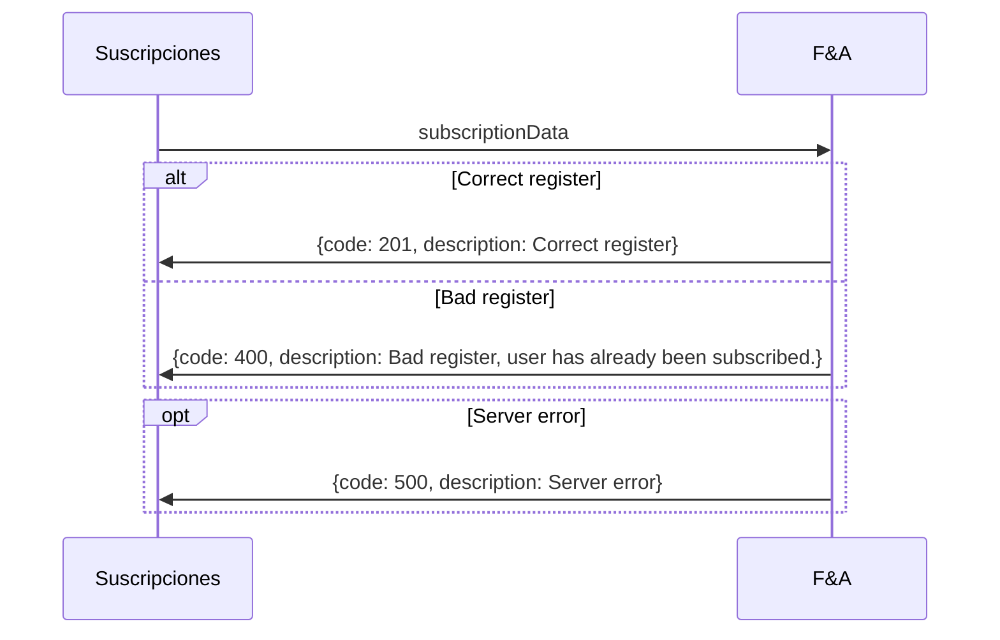

**Última actualización: 18/09/2021**
### Diagrama de secuencia

### Enpoints de integración

==- [!badge size="xl" variant="success" text="POST"]  Registrar suscripción y usuario en F&A

||| Del módulo
Suscripciones
||| Al módulo
Facturación y Autogestión (F&A)
||| Descripción
Nuevo registro de paquete(s) y usuario en el sistema de F&A
|||

[!badge size="l" variant="success" text="POST"] [!badge size="l" variant="secondary" text="https://notflix-fya-backend.herokuapp.com/api/subscriptions/external/new"]

:::code source="../static/externalSubscriptionData.js" :::

===

