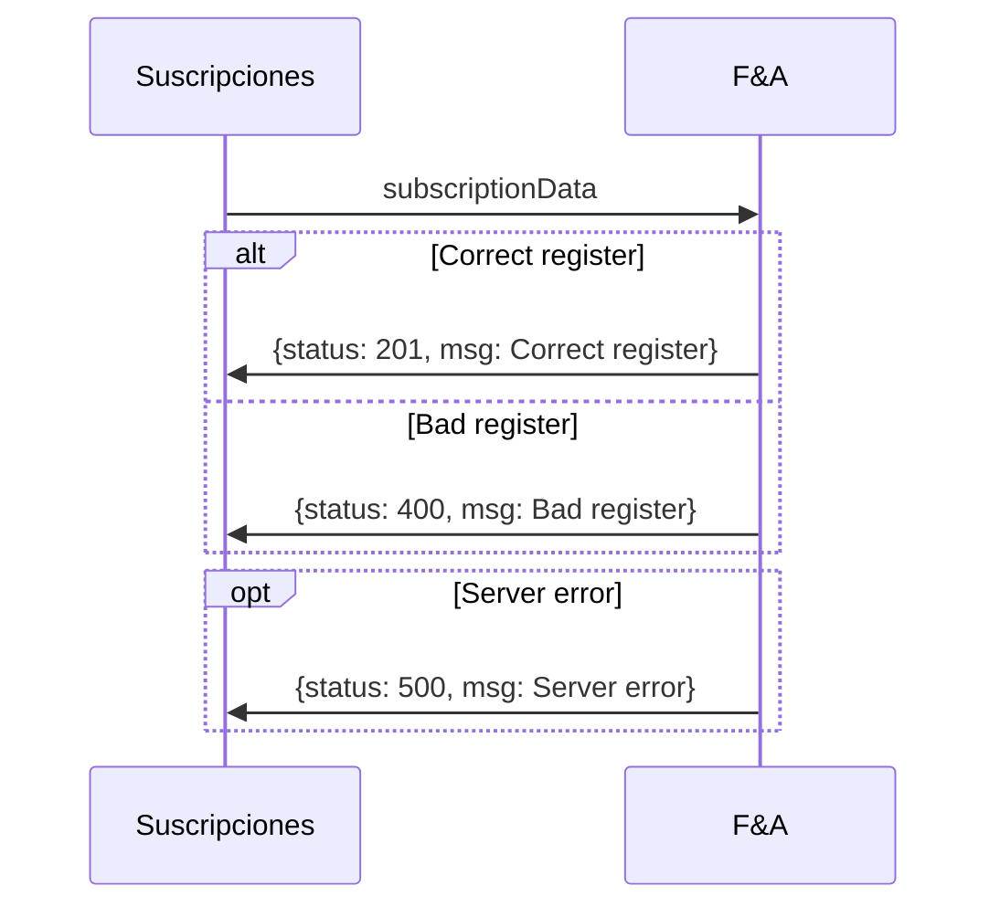
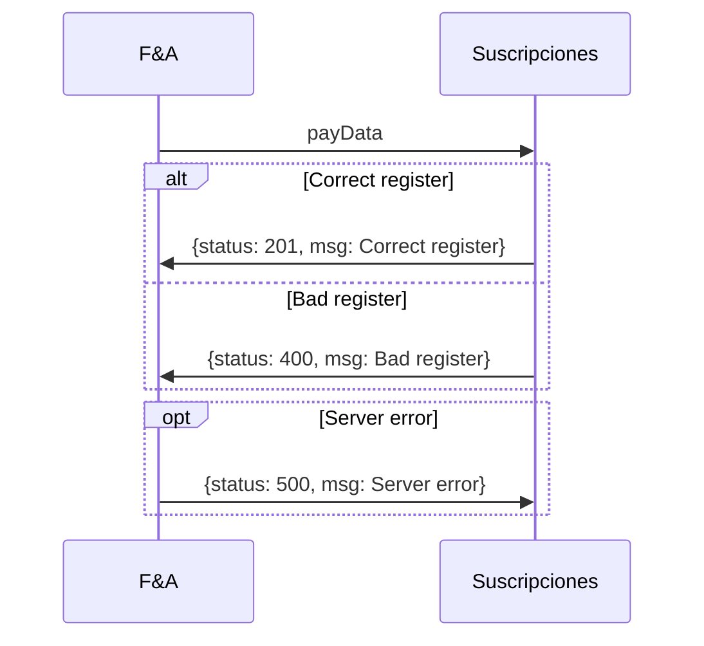

==- Registrar suscripción y usuario en F&A

||| Del módulo
Suscripciones
||| Al módulo
Facturación y Autogestión (F&A)
||| Descripción
Nuevo registro de paquete(s) y usuario en el sistema de F&A
|||

:::code source="../static/subscriptionData.js" :::

===

==- Crear nueva suscripción en suscripciones

||| Del módulo
Facturación y Autogestión (F&A)
||| Al módulo
Suscripciones
||| Descripción
Se le notifica a suscripciones que usuario se suscribió a un nuevo paquete.
|||

===

==- Modificar suscripción en suscripciones

||| Del módulo
Facturación y Autogestión (F&A)
||| Al módulo
Suscripciones
||| Descripción
Se le notifica a suscripciones que usuario modificó un paquete.
|||

===

==- Cancelar suscripción en suscripciones

||| Del módulo
Facturación y Autogestión (F&A)
||| Al módulo
Suscripciones
||| Descripción
Se le notifica a suscripciones que usuario canceló a un paquete.
|||

===

==- Aviso de pago

||| Del módulo
Facturación y Autogestión (F&A)
||| Al módulo
Suscripciones
||| Descripción
Se notifica el o no pago de una suscripcion. Se modifica el estado de la tabla de suscripciones
|||

:::code source="../static/payData.js" :::

===
