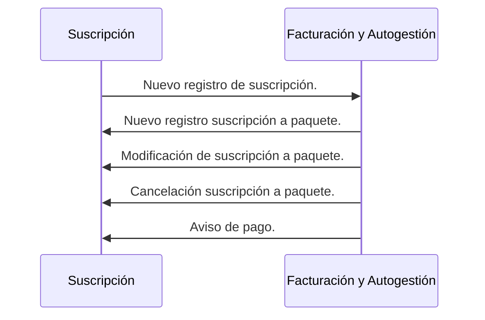
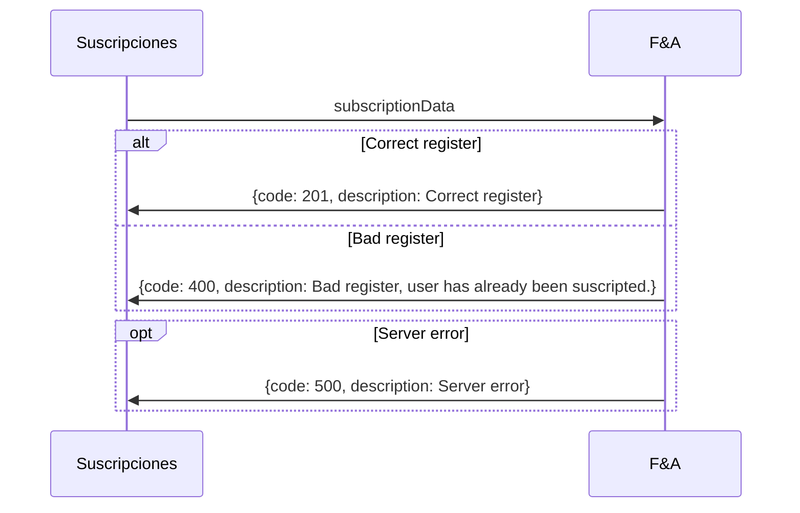
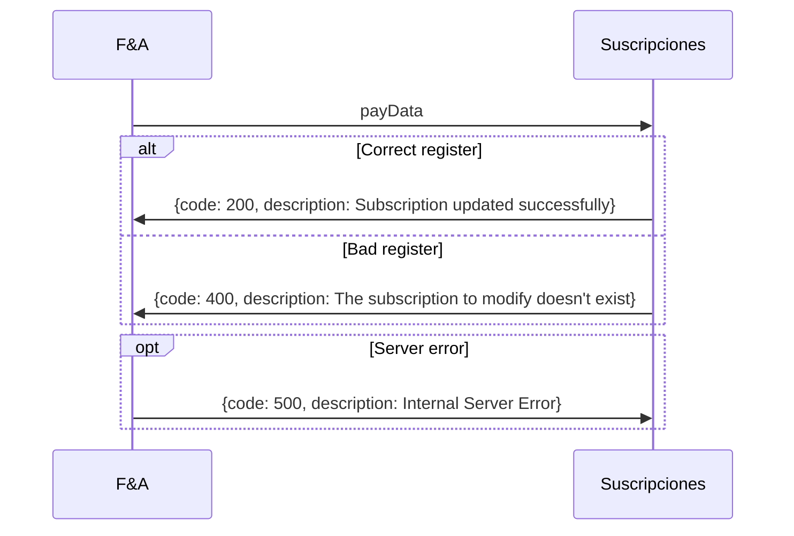

**Última actualización: 18/09/2021**
### Diagrama de secuencia

### Enpoints de integración

==- [!badge size="xl" variant="success" text="POST"]  Registrar suscripción y usuario en F&A

||| Del módulo
Suscripciones
||| Al módulo
Facturación y Autogestión (F&A)
||| Descripción
Nuevo registro de paquete(s) y usuario en el sistema de F&A
|||

[!badge size="l" variant="success" text="POST"] [!badge size="l" variant="secondary" text="ENDPOINT POR DEFINIR"]

:::code source="../static/subscriptionData.js" :::

===

==- [!badge size="xl" variant="danger" text="DELETE"] Cancelar suscripción.

||| Del módulo
Facturación y Autogestión (F&A)
||| Al módulo
Suscripciones
||| Descripción
Se le notifica a suscripciones que usuario canceló a un paquete.
|||

[!badge size="l" variant="danger" text="DELETE"] [!badge size="l" variant="secondary" text="ENDPOINT POR DEFINIR"]
===

==- [!badge size="xl" variant="warning" text="PUT"] Crear nueva suscripción.

||| Del módulo
Facturación y Autogestión (F&A)
||| Al módulo
Suscripciones
||| Descripción
Se le notifica a suscripciones que usuario se suscribió a un nuevo paquete.
|||

[!badge size="l" variant="warning" text="PUT"] [!badge size="l" variant="secondary" text="ENDPOINT POR DEFINIR"]
===

==- [!badge size="xl" variant="warning" text="PUT"] Modificar suscripción.
||| Del módulo
Facturación y Autogestión (F&A)
||| Al módulo
Suscripciones
||| Descripción
Se le notifica a suscripciones que usuario modificó un paquete.
|||

[!badge size="l" variant="warning" text="PUT"] [!badge size="l" variant="secondary" text="ENDPOINT POR DEFINIR"]

===

==- [!badge size="xl" variant="warning" text="PUT"] Aviso de pago

||| Del módulo
Facturación y Autogestión (F&A)
||| Al módulo
Suscripciones
||| Descripción
Se notifica el o no pago de una suscripcion. Se modifica el estado de la tabla de suscripciones
|||

[!badge size="l" variant="warning" text="PUT"] [!badge size="l" variant="secondary" text="ENDPOINT POR DEFINIR"]

:::code source="../static/payData.js" :::

===
